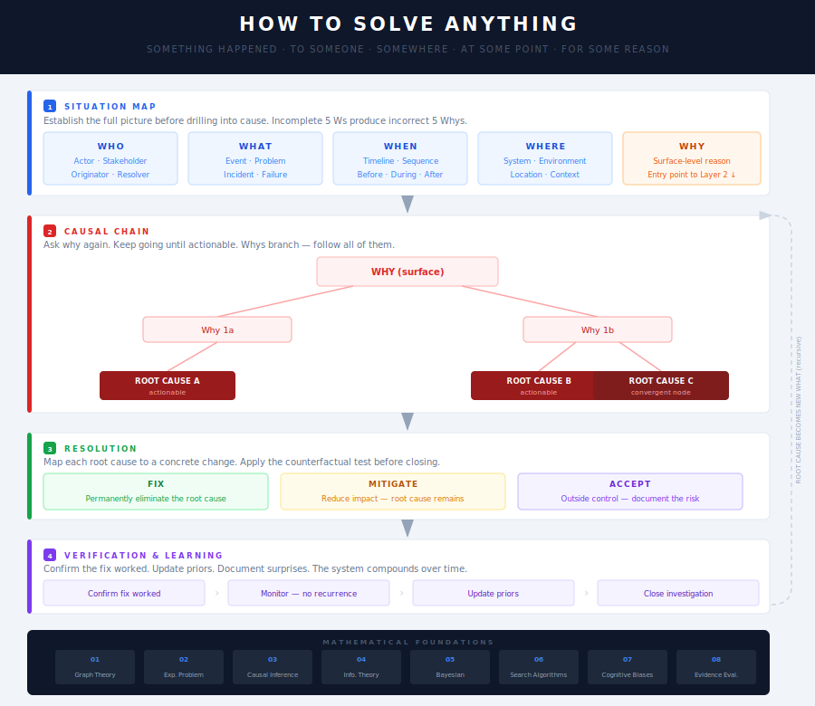
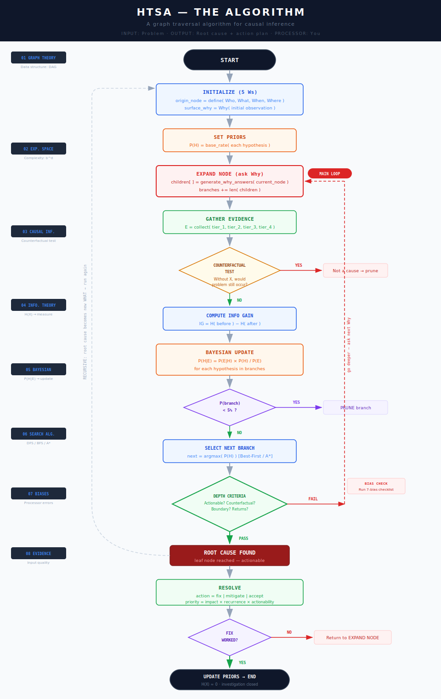

<h1 align="center">How to Solve Anything</h1>

> SOMETHING HAPPENED → TO SOMEONE → SOMEWHERE → AT SOME POINT → FOR SOME REASON

**How to Solve Anything (HTSA)** — A universal investigation framework combining the 5 Ws and 5 Whys.
Applicable to any problem, in any discipline, at any scale.





---

## The Core Insight

Every problem in every field has the same anatomy. The vocabulary changes. The structure never does.

The **5 Ws** tell you *what happened.*
The **5 Whys** tell you *why it happened.*
Together they tell you *what to do about it.*

---

## How It Works

### Layer 1 — Situation Map (5 Ws)
Establish the full picture before drilling into cause.

| Question | What It Captures |
|---|---|
| **Who** | The actor, subject, or stakeholder involved |
| **What** | The event, problem, or incident |
| **When** | The timeline — before, during, and after |
| **Where** | The location, system, environment, or context |
| **Why** | The surface-level, immediately apparent reason |

### Layer 2 — Causal Chain (5 Whys)
Start at the surface Why. Ask why again. Keep going until you hit something you can actually change.

```
Why (surface)
  └─► Why 1
        └─► Why 2
              └─► Why 3
                    └─► Why 4
                          └─► Why 5: ROOT CAUSE
```

Whys can and should branch. Real problems are rarely single-cause.

### Layer 3 — Resolution
Map each root cause to a concrete change. Apply the counterfactual test:
> "If this change had existed before the problem occurred, would the problem still have happened?"

Each root cause is either **fixed**, **mitigated**, or **accepted**.

### Layer 4 — Verification and Learning
Confirm the fix worked. Update your priors. The framework compounds over time — but only if learning is explicit.

---

## Works Everywhere

| Domain | Who | What | When | Where | Why |
|---|---|---|---|---|---|
| Medicine | Patient | Symptom | Onset | Body system | Presenting complaint |
| Security | Threat actor | Breach | Attack window | Vulnerability | Attack vector |
| Engineering | System | Failure | Timeline | Component | Error message |
| Business | Team / Process | Bottleneck | Quarter | Department | Stated reason |
| Legal | Defendant | Act | Date | Jurisdiction | Motive |
| Personal | You | Decision | Moment | Context | Emotion |

---

## The Math

The framework is an applied graph traversal algorithm for causal inference — with probability weighting, entropy reduction, and Bayesian evidence updating at every node.

| # | Concept | What It Answers |
|---|---|---|
| **[01](math/01_graph_theory.md)** | Graph Theory | What is the structure of an investigation? |
| **[02](math/02_exponential_problem_space.md)** | Exponential Problem Space | Why do investigations feel overwhelming? |
| **[03](math/03_causal_inference.md)** | Causal Inference | How do you prove something caused something else? |
| **[04](math/04_information_theory.md)** | Information Theory | How do you measure investigative progress? |
| **[05](math/05_bayesian_reasoning.md)** | Bayesian Reasoning | How do you weigh competing causes? |
| **[06](math/06_search_algorithms.md)** | Search Algorithms | How do you move through the Why tree? |
| **[07](math/07_cognitive_biases.md)** | Cognitive Biases | What corrupts the investigation? |
| **[08](math/08_evidence_evaluation.md)** | Evidence Evaluation | How do you know which evidence to trust? |

---

## Start Here

- **[FRAMEWORK.md](FRAMEWORK.md)** — The complete framework with templates
- **[math/00_index.md](math/00_index.md)** — How the math connects
- **[DIAGRAMS.md](DIAGRAMS.md)** — Framework diagram + algorithm flowchart

---

## Rules

1. **Map before you drill.** Complete the 5 Ws before starting the 5 Whys.
2. **Evidence at every node.** An assertion without evidence is a guess.
3. **Branch when reality branches.** If a Why has multiple answers, follow all of them.
4. **5 is a heuristic, not a rule.** Stop when you reach something you can actually change.
5. **The framework is recursive.** A root cause can become a new "What." Run the whole thing again if needed.
